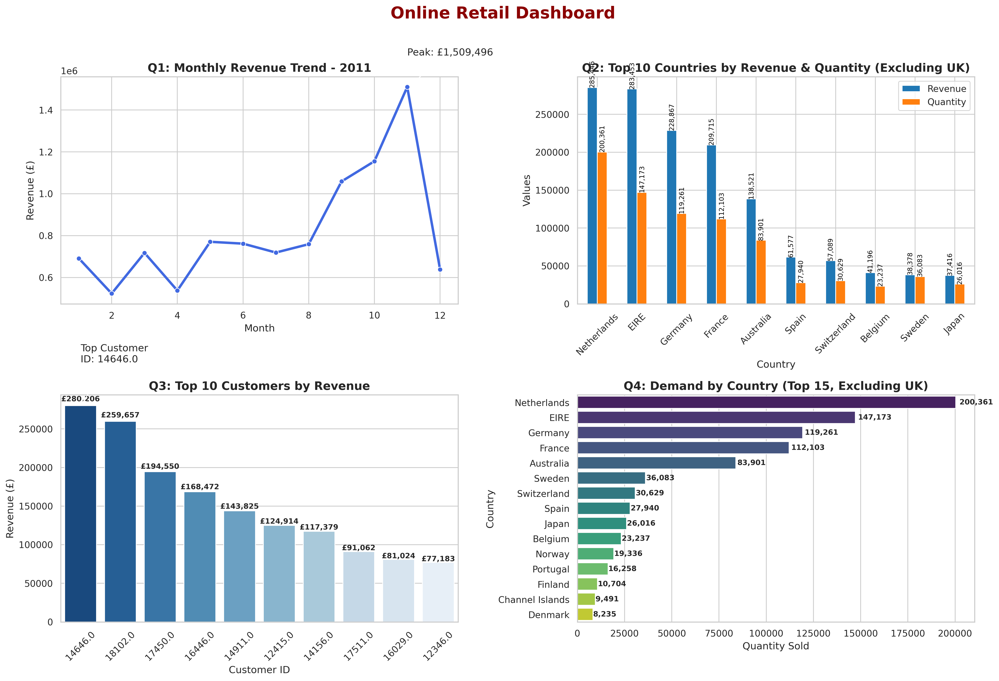

# 🛒 Online Retail Data Analytics Dashboard

This project demonstrates **end-to-end data analytics** on an Online Retail dataset using **Python, Pandas, Matplotlib, and Seaborn**.  
The final result is a **dashboard with four key insights** that would impress recruiters and stakeholders.  

---

## 🚀 Features & Insights
1. **Monthly Revenue Trend (2011)**  
   📊 Line chart showing how revenue changed month by month.  

2. **Top 10 Countries by Revenue & Quantity (Excluding UK)**  
   🌍 Bar chart comparing international market performance.  

3. **Top 10 Customers by Revenue**  
   👥 Identify high-value customers contributing maximum sales.  

4. **Demand by Country (Excluding UK)**  
   📦 Total quantity sold per country – highlighting strongest demand markets.  

---

## 🛠️ Tech Stack
- **Python 3**
- **Pandas** → Data cleaning & aggregation  
- **Matplotlib & Seaborn** → Visualization  
- **Jupyter Notebook / VS Code** → Development  

---

## 📊 Dashboard Output
Here is the generated dashboard 👇  



---

## ⚡ How to Run
1. Clone this repository:
   ```bash
   git clone https://github.com/yourusername/retail-dashboard.git
   cd retail-dashboard
